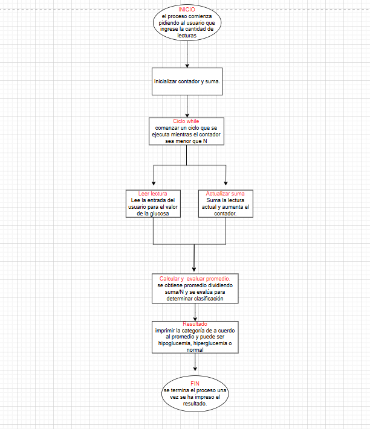
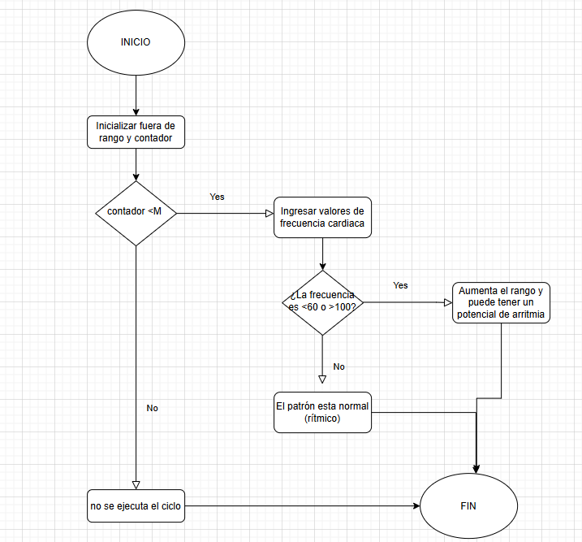
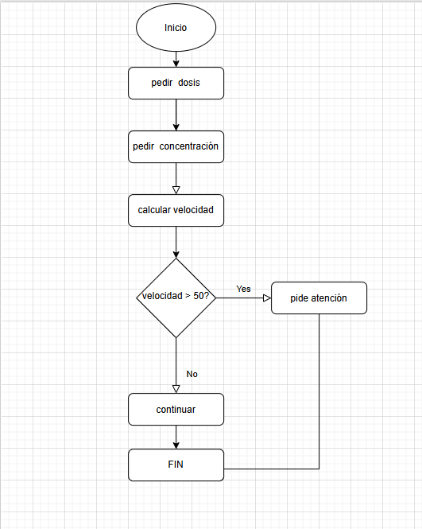

Primer caso: Alertas de glucemia
Este caso clínico consiste en leer múltiples lecturas de glucosa (mg/dL), calcular el promedio y generar una alerta dependiendo del resultado.
Las categorías son:

HIPOGLUCEMIA si el promedio es menor a 70 mg/dL

NORMAL si está entre 70 y 180 mg/dL

HIPERGLUCEMIA si es mayor a 180 mg/dL

Lógica del caso:
El usuario ingresa cuántas lecturas de glucemia desea registrar.

Se leen los valores uno a uno.

Se calcula el promedio.

Se muestra un mensaje de alerta según el promedio.

Segundo caso: Detección de arritmia simple
Este caso clínico consiste en analizar una serie de lecturas de frecuencia cardíaca (ppm) para detectar posibles irregularidades del ritmo cardíaco.
Se evalúan los valores para saber cuántos están fuera del rango normal de 60 a 100 ppm.

Si hay más de 3 valores fuera del rango, se muestra la alerta “POTENCIAL ARRITMIA”.

En caso contrario, se considera “RÍTMICO”.

Lógica del caso:
El usuario indica cuántos valores de frecuencia desea ingresar.

Se capturan uno a uno.

Se cuentan cuántos están por debajo de 60 o por encima de 100.

Se evalúa si se superan los 3 valores fuera de rango.

Tercer caso: Velocidad de infusión IV
Este caso calcula la velocidad de infusión intravenosa con base en la dosis prescrita y la concentración del medicamento.

Se utiliza la fórmula:

Velocidad (mL/h)= Dosis (mg/h)/Concentracion (mg/mL)
​
 
Si la velocidad es mayor a 50 mL/h, se muestra una alerta con el mensaje:
“PIDE ATENCIÓN”

Si no, se muestra:
“Continuar”

Lógica del caso:
Solicita la dosis prescrita (mg/h).

Solicita la concentración (mg/mL).

Calcula la velocidad en mL/h.

Evalúa si la velocidad supera el umbral de seguridad.

